# 💳 Integración de MercadoPago - Documentación Técnica

## Resumen de la Integración

Se implementó una integración completa con MercadoPago Checkout Pro para procesar pagos reales en el sistema de ventas de rifas, eliminando todas las simulaciones de pago previas.

## Archivos Creados/Modificados

### 1. Cliente y Helpers de MercadoPago
**`/lib/mercadopago.ts`**
- Configuración del cliente SDK de MercadoPago
- Función `createPaymentPreference()`: Crea preferencias de pago
- Función `getPaymentInfo()`: Obtiene información de un pago
- Función `isPaymentApproved()`: Verifica estado de aprobación
- Función `getPurchaseIdFromPayment()`: Extrae ID de compra del pago

### 2. API Routes

#### **`/api/preference/route.ts`**
- Endpoint POST para crear preferencias de pago
- Validación con Zod
- Retorna `preferenceId`, `initPoint`, `sandboxInitPoint`

#### **`/api/webhooks/mercadopago/route.ts`**
- Recibe notificaciones IPN de MercadoPago
- Verifica firma HMAC para seguridad
- Procesa eventos de pago (approved/rejected/cancelled)
- Actualiza estado de compras en BD

#### **`/api/payment/success/route.ts`**
- Callback para pagos exitosos
- Redirige al frontend con parámetros de éxito

#### **`/api/payment/failure/route.ts`**
- Callback para pagos fallidos
- Redirige al frontend con motivo de fallo

#### **`/api/payment/pending/route.ts`**
- Callback para pagos pendientes
- Redirige al frontend con estado pendiente

### 3. Frontend

#### **`/components/RifasApp.tsx`**
- Eliminados botones de simulación de pago
- Integrado `createMercadoPagoPreference()` en apiService
- Redirección a Checkout Pro tras crear preferencia
- Manejo de retorno desde MercadoPago vía URL params

## Variables de Entorno Configuradas

```env
# Credenciales de Producción
MERCADO_PAGO_ACCESS_TOKEN=APP_USR-3796491518010506-091111-...
MERCADO_PAGO_PUBLIC_KEY=APP_USR-c6ca8d75-96bc-4729-9b33-...
MERCADO_PAGO_WEBHOOK_SECRET=8b5a80848aded0e7f877bc5209e2bc67...
NEXT_PUBLIC_BASE_URL=https://sistema-ventas-rifas.vercel.app
```

## Flujo de Pago Completo

```mermaid
sequenceDiagram
    participant U as Usuario
    participant F as Frontend
    participant API as API Backend
    participant MP as MercadoPago
    participant DB as Turso DB

    U->>F: Selecciona números y completa formulario
    F->>API: POST /api/purchase (crear compra)
    API->>DB: Crea purchase con status='pending'
    API->>DB: Reserva números temporalmente
    API-->>F: Retorna purchase ID
    
    F->>API: POST /api/preference
    API->>MP: Crea preferencia de pago
    MP-->>API: Retorna preference ID y URLs
    API-->>F: Retorna initPoint URL
    
    F->>MP: Redirige usuario a Checkout Pro
    U->>MP: Completa pago
    
    alt Pago Exitoso
        MP->>API: Webhook IPN (payment.created)
        API->>DB: Confirma purchase
        API->>DB: Marca números como 'sold'
        MP->>F: Redirige a /payment/success
        F->>U: Muestra confirmación
    else Pago Fallido
        MP->>API: Webhook IPN (payment.rejected)
        API->>DB: Cancela purchase
        API->>DB: Libera números a 'available'
        MP->>F: Redirige a /payment/failure
        F->>U: Muestra error
    end
```



## Configuración de Webhook

### URL del Webhook
```
https://sistema-ventas-rifas.vercel.app/api/webhooks/mercadopago
```

### Eventos Configurados
- `payment.created`
- `payment.updated`

### Verificación de Seguridad
- Firma HMAC-SHA256 usando `x-signature` header
- Secret key configurado en variable de entorno

## Manejo de Estados

### Estados de Purchase
- `pending`: Compra creada, esperando pago
- `approved`: Pago confirmado por MercadoPago
- `rejected`: Pago rechazado
- `cancelled`: Compra cancelada

### Estados de Números
- `available`: Disponible para compra
- `reserved`: Reservado temporalmente (15 min)
- `sold`: Vendido y pagado

## Configuración de Preferencia

```typescript
{
  items: [{
    id: purchaseId,
    title: `Rifa Escolar 2025 - Números: ${numbers}`,
    quantity: 1,
    unit_price: totalAmount,
    currency_id: 'ARS'
  }],
  back_urls: {
    success: '/api/payment/success',
    failure: '/api/payment/failure',
    pending: '/api/payment/pending'
  },
  auto_return: 'approved',
  external_reference: purchaseId,
  notification_url: '/api/webhooks/mercadopago',
  expires: true,
  expiration_date_to: '15 minutos desde creación'
}
```

## Testing

### Modo Sandbox
Para pruebas, usar credenciales de sandbox y tarjetas de prueba de MercadoPago:
- https://www.mercadopago.com.ar/developers/es/docs/checkout-pro/additional-content/test-cards

### Producción
- Credenciales de producción configuradas
- Webhook verificado y funcionando
- Variables de entorno en Vercel configuradas

## Troubleshooting

### Error "Error procesando la compra"
- Verificar que `MERCADO_PAGO_ACCESS_TOKEN` esté configurado en Vercel
- Verificar que todas las variables de entorno estén completas

### Webhook no recibe notificaciones
- Verificar URL del webhook en dashboard de MercadoPago
- Verificar que el secret coincida
- Revisar logs en Vercel Functions

### No se puede pagar
- No es posible pagarse a uno mismo con la misma cuenta
- Usar cuenta diferente o modo sandbox para pruebas

## Documentación de Referencia

- [MercadoPago Checkout Pro](https://www.mercadopago.com.ar/developers/es/docs/checkout-pro/landing)
- [SDK Node.js](https://github.com/mercadopago/sdk-nodejs)
- [Webhooks IPN](https://www.mercadopago.com.ar/developers/es/docs/your-integrations/notifications/ipn)

---

**Implementado por**: Claude & Rodrigo Di Bernardo  
**Fecha**: 11 de Septiembre de 2025  
**Versión**: 1.0.0